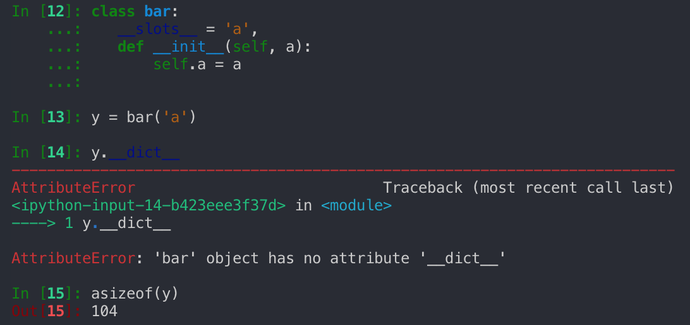

<center>
  
  Photo by Tim Gouw on Unsplash
</center>

# Managing Memory

An assignment that [Jasmine](https://github.com/lacunahag) and I had recently done for my instructor, [Alan Davis](https://www.linkedin.com/in/alancdavis/), at [Make School](https://www.makeschool.com/) was given a large list of phone routes consisting of their standardized prefixes and costs.

The task was for increasing amounts of routes and phone numbers to find the longest matches and their prices.

[Project Readme](https://github.com/Make-School-Courses/CS-1.3-Core-Data-Structures/blob/a622779357b055f925feb5f000996cb26c2ddf66/project/ReadMe.md)

## Attempts

#### List

One being performing linear search on a list of phone numbers because I couldn't figure out a way to perform binary search.

[File](https://github.com/lacunahag/call_routing_project/blob/e05e1577fc2f946b268ac4451fd7e11d4a8d6501/scenario1.py)

#### Dictionary

Our next step was to throw it all into a dictionary and keep removing characters off of my numbers until there was a match.

[File](https://github.com/lacunahag/call_routing_project/blob/e8d1fbe7a2d8560fd27e1b99ab9b445ad994e2a1/scenario2.py)

#### Trie

Jasmine said that [tries](https://en.wikipedia.org/wiki/Trie) might be a good solution. You can read more about them [here](https://medium.com/basecs/trying-to-understand-tries-3ec6bede0014). Basically, they are a way of storing sequences of values, most commonly being strings.

<center>
  
  Diagram - <a href="https://commons.wikimedia.org/wiki/File:Trie_example.svg">Source</a>
</center>

To our dismay, it was using ***3 GB of RAM*** on a 10 million route dataset! When Jasmine tried to build her own it actually crashed on her laptop with 8 GB of RAM in total.

***It was time to track down where all our RAM going.***

# Tips and Resources

Through my attempts to optimize the memory, I have some pointers.

## [Pympler](https://pythonhosted.org/Pympler/)

Pympler is a powerful tool to analyze memory usage.

### [pympler.asizeof.asizeof](https://pythonhosted.org/Pympler/library/asizeof.html?highlight=asizeof%20asizeof#pympler.asizeof.asizeof)

This function recursively checks every object referenced by several objects allowing you to get the actual size in bytes.

<center>
  
  That's a whopping 1.2 GB!
</center>

### [pympler.tracker.SummaryTracker](https://pythonhosted.org/Pympler/library/tracker.html?highlight=summarytracker#pympler.tracker.SummaryTracker)

This class has a function called `print_diff` shows you how many of each type of new object there are and the amount of memory that they take up. This is useful

<center>
  
</center>

This tracker is telling me that I should figure out how to *reduce the number of subtries* that I'm creating and perhaps find another way to use lists.

The first time I used it I realized that I needed to **stop using so many dictionaries**. If I know the exact inputs my Trie will be receiving I could use one dictionary to map characters to parts of a list.

### Much much more

Pympler has much more in store, I'd highly recommend going through their documentation and seeing if there's anything of use.

## [tracemalloc](https://docs.python.org/3/library/tracemalloc.html)

Python 3.4 and up has a built-in memory tracer, but I admit I don't have as much experience with it.

## Use `__slots__`!

Slots in Python are a pretty quick way to reduce the memory usage of an object. By default Python uses dictionaries to store class attributes which you find in the variable `__dict__`.

<center>
  
</center>

If you instead explicitly define which variables using `__slots__` your object will have you can save a *substantial* amount of memory which pays off with recursive data structures like tries.

<center>
  
</center>

By using slots more than halved our memory usage while still storing the same data.

## Default to None

In my Tries, I realized that there are a lot of moments when a Trie won't have any subtries, but I still made a list for them.

Although there's a bit of a tradeoff, I believe in situations where you have 4.6 million of the same object it's worth it to default variables to None and only creates them when necessary

<center>
  
  The difference in sizes.
</center>

You can see that with more than **4 million nodes** the size of both empty dictionaries and empty lists can add up *incredibly* quickly.

> You should only create data structures when they're being used.

## Use Smaller Types

You might fall into the pattern of reusing one datatype multiple times because it worked like a dictionary.

> Nested dictionaries are common, but what if the keys are predictable?

In our phone number problem, I realized that there were only going to be 11 characters "+1234567890", so why should I use a data structure optimized for arbitrary keys?

I decided it would be worth it to create a "mapper" that converts a character into an index in a list.

```python
def __init__(self, keys = None, items = None, _value = None, _mapper =  None):
  if _mapper:
    self._mapper = _mapper
  elif keys:
    self._mapper = {item: index for index, item in enumerate(keys)}
  else:
    raise ValueError('keys or _mapper must be provided')

  self._subtries = None
```

[Commit](https://github.com/lacunahag/call_routing_project/commit/4605171ef87696d555b880f41f9101b5041bc54c)

This allows me to generate a mapper at the root and pass it down. I can then use it to get the index of where a Trie *should* be. This was **by far** one of the best optimizations that I made and reduced my memory usage from around **3 GB to 1.5 GB**.

# Conclusion

Optimizing your code for memory usage might not be one of the first things you might think to do. Once you're operating at scale, however, it becomes just as important as speed.

Take a look at [our repo](https://github.com/lacunahag/call_routing_project) if you want to see our solution to the phone numbers problem

> I'm looking for internships, so don't be afraid to reach out! [My LinkedIn](https://www.linkedin.com/in/dacioromero/)
